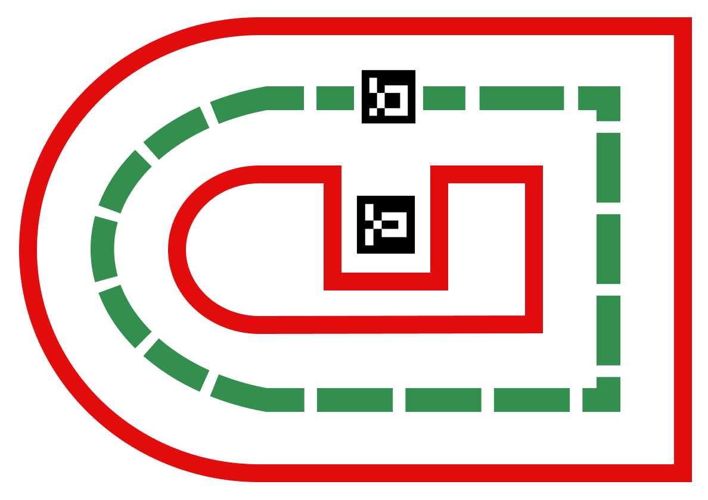

# _Competition Design_

## Important Links
* [Competition Submission Form](https://forms.gle/LDLXWPZB9BomwcrW8)
* [Track Design](https://www.figma.com/file/p5jf9avmuazf1W6wpArfBC/Track-Design?node-id=0%3A1&t=aimGM4e57DGKQQKU-1)
* [Website UI Design](https://www.figma.com/file/f0m3vaIETOb2ZpTYRg89y4/Robot-Competition-Website?node-id=0%3A1)

---
 

## Competition Details
#### _Location_
The competition is to be taken place online remotely.

#### _Schedule_
There is no strict start or end date to the competition.

#### _Entry_
To accept entries into the competition, a Google Form was made where people can enter - [Competition Submission Form](https://forms.gle/LDLXWPZB9BomwcrW8)

#### _Scoring and Results_
Each submission will be judged by how fast it can navigate the track at each stage. Three attempts will be taken at each stage, then the best time will be recorded as the official time for that contestant. For simplicity, the timings would be recorded with only a stopwatch. Each stage would have a leaderboard and a competitor’s rank on the leaderboard would allocate them a score which is collated for the overall competition.

#### _Penalties_
If part of the robot passed over the track edges
at any point, a time penalty of +2 seconds would be added to the overall time for that stage. Additionally, if the robot were to fully cross the edge line, then it would be disqualified from that stage, but would still be allowed to compete in later stage.

#### _Stages_
The competition was split into multiple stages. These stages are detailed in the table below:

| Stage |                             Description                            | Method of Control | Track Section |     Challenge     |
|:-----:|:------------------------------------------------------------------:|:-----------------:|:-------------:|:-----------------:|
|   1   |         A straight line track navigated with a controller          |       Manual      | Straight Line |       None        |
|   2   |            A straight line track navigated by the robot            |     Autonomous    | Straight Line |       None        |
|   3   |              Full track navigated with the controller              |       Manual      |   Full Track  |       None        |
|   4   |                  Full track navigated by the robot                 |     Autonomous    |   Full Track  |       None        |
|   5   |     The full track with the controller but with added obstacles    |       Manual      |   Full Track  |     Obstacles     |
|   6   |        The full track with obstacles navigated by the robot        |     Autonomous    |   Full Track  |     Obstacles     |
|   7   |       The full track with a parking zone using the controller      |       Manual      |   Full Track  |      Parking      |
|   8   |     The full track with the parking zone navigated by the robot    |     Autonomous    |   Full Track  |      Parking      |
|   9   |  Full track, obstacles, and the parking zone using the controller  |       Manual      |   Full Track  | Obstacles+Parking |
|   10  | Full track, obstacles, and the parking zone navigated by the robot |     Autonomous    |   Full Track  | Obstacles+Parking |

 

--- 
 

## Track Design
The design and measurements for the race-track were made using Figma and can be seen via this link: [Track Design](https://www.figma.com/file/p5jf9avmuazf1W6wpArfBC/Track-Design?node-id=0%3A1&t=aimGM4e57DGKQQKU-1)

Below is the final design for the race-track:

---
 

## Website Design
Wireframes for the website pages were made using Figma and can be seen via this link: [Website Design](https://www.figma.com/file/f0m3vaIETOb2ZpTYRg89y4/Robot-Competition-Website?node-id=0%3A1)