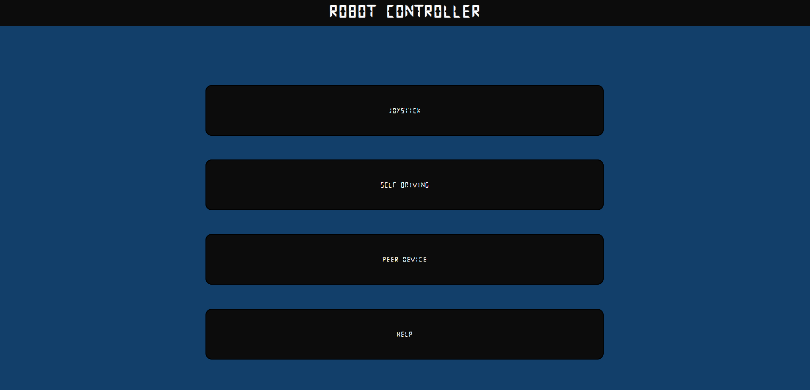
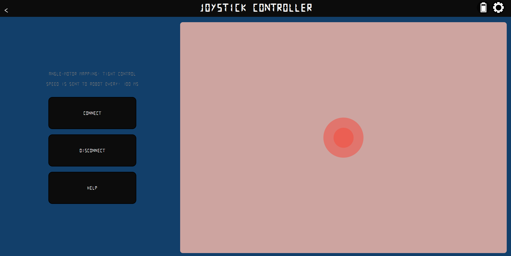
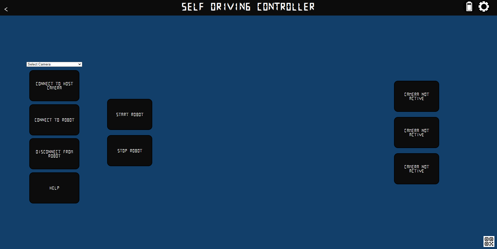
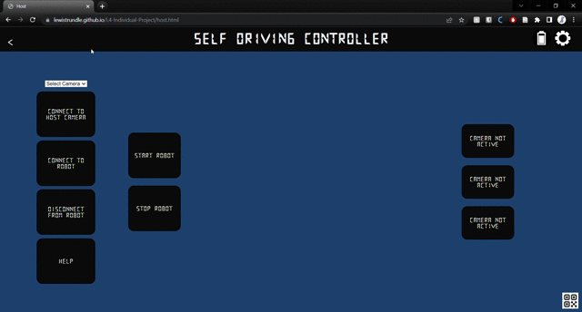
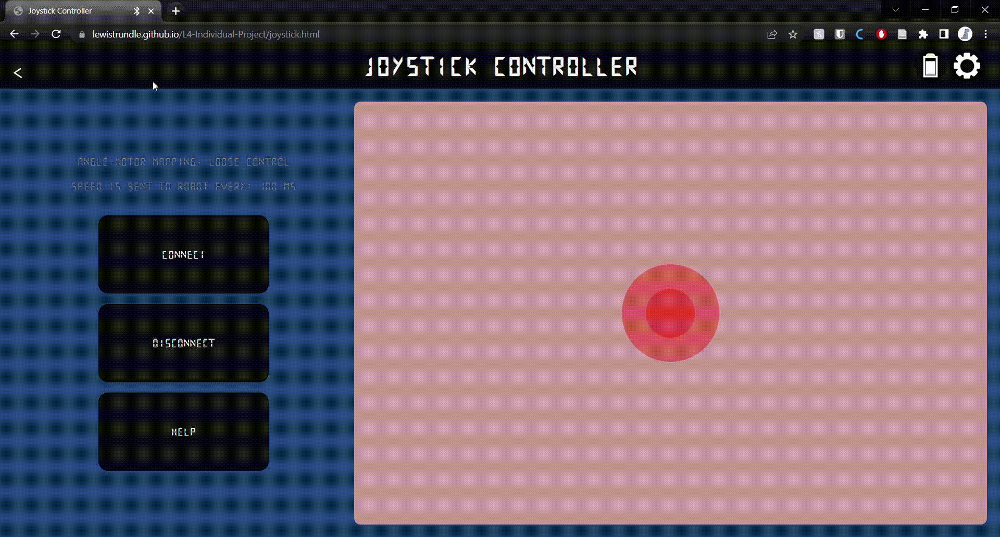

# _User manual_ 

Provided below are instructions on how to use the robot controller.

## Controller
The home-page of the controller has 4 buttons as seen in the image below.

 
 

---
 
 

## Joystick
The joystick page of the controller allows the user to manually control the robot using the provided in-built joystick.

Before the joystick can be used, the user must first connect to the robot. To do this, please see [_Connecting to the Robot_](#connecting-to-the-robot).

To change the angle-motor mapping, please see [_Changing the Angle-Motor Mapping_](#changing-the-angle-motor-mapping).

To change the code speed, please see [_Adjusting the Code Speed_](#adjusting-the-code-speed).

 
 

---
 
 

## Self-Driving
The self-driving page of the controller allows the robot to drive autonomously using vision methods.

Before these features can be used, please first enable camera permissions on your web browser [Enabling Camera Permissions](#enabling-camera-permissions).

To use the Virtual Lead feature, please see [_Virtual Lead_](#virtual-lead).

 

### Enabling Camera Permissions
To enable camera permissions on Chrome, simply click the lock icon next to the search bar and toggle camera permissions on.

### Connecting to Host Cameras
To connect to your host cameras (the device running the web-browser), select a camera from the drop-down list, then click the 'Connect to Host Camera' button.

### Connecting to Peer Cameras
To connect to cameras on a separate device, the devices first need to be linked. This can be done by scanning the QR code in the bottom-right corner.

### Controlling Vision Methods
The buttons at the right-side of the screen can be used to toggle which vision methods are active.

 
 

---
 
 

## Virtual Lead
The Virtual Lead feature allows the robot to follow the midpoint of the camera screen. This is done by detecting a marker attached to the robot and calculating the angle to turn to the midpoint. 
To use this feature, please do the following:
* Make sure your camera permissions are enabled [_Enabling Camera Permissions_](#enabling-camera-permissions).
* Make sure a qr-code or aruco marker is attached to the robot so it can be detected by a camera.
* Connect to a camera [_Connecting to Host Cameras_](#connecting-to-host-cameras) or [_Connecting to Peer Cameras_](#connecting-to-peer-cameras). It is best to use a peer device for this feature.
* Turn off colour-tracking, greyscale conversion, and colour-space conversion [_Controlling Vision Methods_](#controlling-vision-methods) 
* Connect to the robot [_Connecting to the Robot_](#connecting-to-the-robot).
* Enjoy!

There are a couple of important things to note while using this feature.
* The markers are detected best when your camera is ~0.5 meters away from the marker. The markers are also not detected well when they are at the edge of the camera screen.
* The quality of detection greatly depends on the quality of the camera used. Common Andriod phones have a poor camera quality, making the marker detection difficult.
* The lighting conditions matter greatly when detecting markers. It may take a few minutes to find the right lighting conditions which aren't too bright or dark.

 
 

---
 
 

## Connecting to the robot
There are a number of ways to connect to the robot, however, the easiest option is to either simply click 'connect' or move the joystick.

To connect to the robot, select the 'Web Bluetooth' option. Then select your device. When 'pair' is selected, the browser will then attempt to connect to your device - this may take a couple of seconds.

 
 

---
 
 

## Settings
There are many various settings which can be adjusted for the robot. To access these settings, simply click the cog icon in the top-right corner.

 

### Adjusting the Code Speed
The speed at which code is sent to the robot can be adjusted in the settings modal. To do this, simply drag the slider to the desired speed. The speed is measured in milliseconds.

### Changing the Angle-Motor Mapping
The mapping of joystick angle to motor speed can be changed via the angle-motor mapping button. There are currently two possible mappings:
#### _Tight Control_
With this mapping, the robot will move at tighter angles, meaning small turns of the joystick correspond to higher turn-angles.
#### _Loose Control_
With this mapping, the robot will move at looser angles, meaning small turns of the joystick correspond to small turn-angles.

### Diagnostic
To test how the robot moves at each angle of your current angle-motor mapping, a diagnostic can be performed by simply clicking the diagnostic button. A specific angle can be chosen, or all specified angles can be tested in order.

### Changing the Robot Code
To view the code currently on the robot, select 'robot code' option.
On the left side, is code which can be uploaded to the robot, and on the right side is the code currently on the robot.
* _Get Device Code_: To get the code currently on the robot, select the 'get device code' option.
* _Upload Code_: To upload the code on the left to the robot, select the 'upload code' option.
* _Reset Code_: To reset the code on the robot, select the 'reset code' option.

### Checking the Battery Level
To check the battery percentage, simply click the battery icon in the top right corner.

